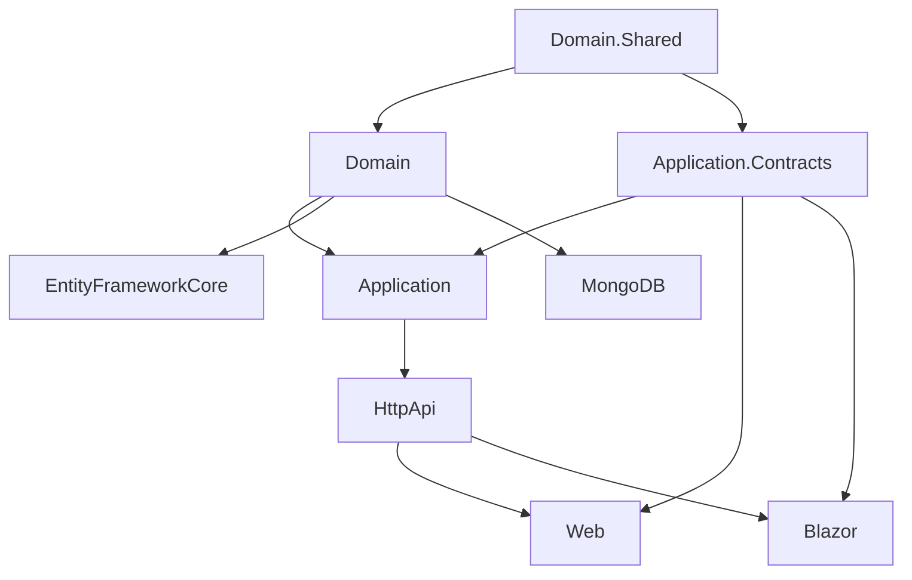

# Arquitetura Modular ABP.io Pro

Este documento explica a arquitetura modular do ABP.io Framework e como ela é aplicada nos módulos comerciais Pro.

## 🏗️ Visão Geral da Arquitetura

O ABP Framework utiliza uma arquitetura modular baseada em **Domain-Driven Design (DDD)** com as seguintes características:

```
┌─────────────────────────────────────────────────────────────────┐
│                        Presentation Layer                        │
│  ┌───────────┐  ┌───────────┐  ┌───────────┐  ┌───────────────┐ │
│  │    Web    │  │   Blazor  │  │  Angular  │  │    MAUI       │ │
│  │(MVC/Razor)│  │Server/WASM│  │           │  │  Blazor       │ │
│  └─────┬─────┘  └─────┬─────┘  └─────┬─────┘  └───────┬───────┘ │
└────────┼──────────────┼──────────────┼────────────────┼─────────┘
         │              │              │                │
         └──────────────┴──────────────┴────────────────┘
                              │
┌─────────────────────────────┼───────────────────────────────────┐
│                             ▼                                    │
│                      HttpApi Layer                               │
│  ┌───────────────────────────────────────────────────────────┐  │
│  │                  REST API Controllers                      │  │
│  │              (Auto-generates from App Services)            │  │
│  └───────────────────────────────────────────────────────────┘  │
└─────────────────────────────┬───────────────────────────────────┘
                              │
┌─────────────────────────────┼───────────────────────────────────┐
│                             ▼                                    │
│                    Application Layer                             │
│  ┌─────────────────────────────────────────────────────────────┐│
│  │              Application Services (Use Cases)                ││
│  │                    ↓ implements ↓                            ││
│  │              Application.Contracts (Interfaces + DTOs)       ││
│  └─────────────────────────────────────────────────────────────┘│
└─────────────────────────────┬───────────────────────────────────┘
                              │
┌─────────────────────────────┼───────────────────────────────────┐
│                             ▼                                    │
│                       Domain Layer                               │
│  ┌─────────────────────────────────────────────────────────────┐│
│  │         Entities, Aggregates, Domain Services                ││
│  │         Repositories (Interfaces), Events                    ││
│  │                    ↓ uses ↓                                  ││
│  │         Domain.Shared (Constants, Enums, Localization)       ││
│  └─────────────────────────────────────────────────────────────┘│
└─────────────────────────────┬───────────────────────────────────┘
                              │
┌─────────────────────────────┼───────────────────────────────────┐
│                             ▼                                    │
│                  Infrastructure Layer                            │
│  ┌─────────────────────────────────────────────────────────────┐│
│  │    EntityFrameworkCore    │    MongoDB Implementation        ││
│  │   (Repository Impl, DbContext, Migrations)                   ││
│  └─────────────────────────────────────────────────────────────┘│
└─────────────────────────────────────────────────────────────────┘
```

## 📦 Camadas e Projetos

### Domain.Shared

**Propósito**: Tipos compartilhados entre todos os projetos (não só deste módulo).

```
Volo.{Module}.Domain.Shared/
├── Volo/{Module}/
│   ├── {Module}Consts.cs           # Constantes (MaxLength, etc)
│   ├── {Module}ErrorCodes.cs       # Códigos de erro
│   ├── Localization/               # Arquivos de localização
│   │   ├── {Module}Resource.cs
│   │   └── en.json, pt-BR.json
│   ├── Enums/                      # Enumerações
│   └── {Module}DomainSharedModule.cs
└── {Module}.Domain.Shared.csproj
```

**Dependências típicas**:
```xml
<PackageReference Include="Volo.Abp.Validation" />
<PackageReference Include="Volo.Abp.Localization.Abstractions" />
```

### Domain

**Propósito**: Contém a lógica de negócio central (entidades, regras, serviços de domínio).

```
Volo.{Module}.Domain/
├── Volo/{Module}/
│   ├── Entities/                   # Aggregate Roots e Entities
│   │   ├── {Entity}.cs
│   │   └── I{Entity}Repository.cs  # Interface do repositório
│   ├── Managers/                   # Domain Services
│   │   └── {Entity}Manager.cs
│   ├── {Module}DbProperties.cs     # Nome do DB/Collection
│   ├── {Module}DomainMappingProfile.cs  # AutoMapper
│   └── {Module}DomainModule.cs     # Módulo ABP
└── {Module}.Domain.csproj
```

**Dependências típicas**:
```xml
<PackageReference Include="Volo.Abp.Ddd.Domain" />
<PackageReference Include="Volo.Abp.AutoMapper" />
<ProjectReference Include="../{Module}.Domain.Shared/{Module}.Domain.Shared.csproj" />
```

### Application.Contracts

**Propósito**: Define a API de aplicação (interfaces de serviços e DTOs).

```
Volo.{Module}.Application.Contracts/
├── Volo/{Module}/
│   ├── I{Entity}AppService.cs      # Interface do App Service
│   ├── Dtos/
│   │   ├── {Entity}Dto.cs
│   │   ├── Create{Entity}Dto.cs
│   │   ├── Update{Entity}Dto.cs
│   │   └── Get{Entity}ListInput.cs
│   ├── Permissions/
│   │   ├── {Module}Permissions.cs
│   │   └── {Module}PermissionDefinitionProvider.cs
│   └── {Module}ApplicationContractsModule.cs
└── {Module}.Application.Contracts.csproj
```

**Dependências típicas**:
```xml
<PackageReference Include="Volo.Abp.Ddd.Application.Contracts" />
<ProjectReference Include="../{Module}.Domain.Shared/{Module}.Domain.Shared.csproj" />
```

### Application

**Propósito**: Implementa os casos de uso (Application Services).

```
Volo.{Module}.Application/
├── Volo/{Module}/
│   ├── {Entity}AppService.cs       # Implementação
│   ├── {Module}ApplicationMappingProfile.cs
│   └── {Module}ApplicationModule.cs
└── {Module}.Application.csproj
```

**Dependências típicas**:
```xml
<ProjectReference Include="../{Module}.Application.Contracts/{Module}.Application.Contracts.csproj" />
<ProjectReference Include="../{Module}.Domain/{Module}.Domain.csproj" />
```

### EntityFrameworkCore

**Propósito**: Implementação de persistência com EF Core.

```
Volo.{Module}.EntityFrameworkCore/
├── Volo/{Module}/
│   ├── EntityFrameworkCore/
│   │   ├── I{Module}DbContext.cs   # Interface DbContext
│   │   ├── {Module}DbContext.cs    # DbContext
│   │   ├── {Module}DbContextModelCreatingExtensions.cs
│   │   └── {Module}EntityFrameworkCoreModule.cs
│   ├── Repositories/
│   │   └── Ef{Entity}Repository.cs
│   └── Migrations/
└── {Module}.EntityFrameworkCore.csproj
```

### MongoDB

**Propósito**: Implementação alternativa com MongoDB.

```
Volo.{Module}.MongoDB/
├── Volo/{Module}/
│   ├── MongoDB/
│   │   ├── I{Module}MongoDbContext.cs
│   │   ├── {Module}MongoDbContext.cs
│   │   ├── {Module}MongoDbModule.cs
│   │   └── {Module}BsonClassMaps.cs
│   └── Repositories/
│       └── Mongo{Entity}Repository.cs
└── {Module}.MongoDB.csproj
```

### HttpApi

**Propósito**: Expõe os Application Services como REST API.

```
Volo.{Module}.HttpApi/
├── Volo/{Module}/
│   ├── {Entity}Controller.cs       # Controller REST
│   └── {Module}HttpApiModule.cs
└── {Module}.HttpApi.csproj
```

### HttpApi.Client

**Propósito**: Cliente HTTP para consumir a API remotamente.

```
Volo.{Module}.HttpApi.Client/
├── Volo/{Module}/
│   ├── {Module}HttpApiClientModule.cs
│   └── {Entity}ClientProxy.cs      # (opcional, geralmente auto-gerado)
└── {Module}.HttpApi.Client.csproj
```

### Web (MVC/Razor Pages)

**Propósito**: UI usando ASP.NET Core MVC/Razor Pages.

```
Volo.{Module}.Web/
├── Volo/{Module}/
│   ├── Pages/{Module}/             # Razor Pages
│   │   ├── Index.cshtml
│   │   ├── Index.cshtml.cs
│   │   ├── CreateModal.cshtml
│   │   └── EditModal.cshtml
│   ├── Components/                 # ViewComponents
│   ├── Menus/
│   │   └── {Module}MenuContributor.cs
│   └── {Module}WebModule.cs
├── wwwroot/                        # Static files (js, css)
└── {Module}.Web.csproj
```

### Blazor

**Propósito**: UI usando Blazor.

```
Volo.{Module}.Blazor/
├── Components/
│   ├── {Entity}List.razor
│   └── {Entity}Edit.razor
├── Menus/
│   └── {Module}MenuContributor.cs
└── {Module}BlazorModule.cs
```

## 🔌 Sistema de Módulos ABP

### AbpModule

Cada projeto tem uma classe `Module` que herda de `AbpModule`:

```csharp
[DependsOn(
    typeof(AbpDddDomainModule),
    typeof({Module}DomainSharedModule),
    typeof(AbpAutoMapperModule)
)]
public class {Module}DomainModule : AbpModule
{
    public override void ConfigureServices(ServiceConfigurationContext context)
    {
        // Configurações
    }
    
    public override void OnApplicationInitialization(ApplicationInitializationContext context)
    {
        // Inicialização
    }
}
```

### Atributo DependsOn

Define dependências entre módulos:

```csharp
[DependsOn(
    typeof(SaasDomainSharedModule),      // Dependência local
    typeof(AbpMultiTenancyModule),       // Dependência do framework
    typeof(AbpFeatureManagementDomainModule)  // Outro módulo
)]
public class SaasDomainModule : AbpModule
```

### Grafo de Dependências



## 📐 Convenções de Nomenclatura

| Tipo | Convenção | Exemplo |
|------|-----------|---------|
| Aggregate Root | `{Entity}` | `Tenant`, `Edition` |
| Repository Interface | `I{Entity}Repository` | `ITenantRepository` |
| Repository Impl (EF) | `Ef{Entity}Repository` | `EfTenantRepository` |
| Repository Impl (Mongo) | `Mongo{Entity}Repository` | `MongoTenantRepository` |
| App Service Interface | `I{Entity}AppService` | `ITenantAppService` |
| App Service | `{Entity}AppService` | `TenantAppService` |
| Controller | `{Entity}Controller` | `TenantController` |
| DTO | `{Entity}Dto`, `Create{Entity}Dto` | `TenantDto`, `CreateTenantDto` |
| Module | `{Module}DomainModule` | `SaasDomainModule` |
| DbContext | `{Module}DbContext` | `SaasDbContext` |

## 🏭 Padrões de Design Utilizados

### Repository Pattern

```csharp
// Interface (Domain layer)
public interface ITenantRepository : IRepository<Tenant, Guid>
{
    Task<Tenant> FindByNameAsync(string name);
    Task<List<Tenant>> GetListAsync(string filter = null, ...);
}

// Implementação (Infrastructure layer)
public class EfCoreTenantRepository : EfCoreRepository<ISaasDbContext, Tenant, Guid>, ITenantRepository
{
    public async Task<Tenant> FindByNameAsync(string name)
    {
        return await DbSet.FirstOrDefaultAsync(t => t.NormalizedName == name);
    }
}
```

### Domain Service Pattern

```csharp
public class TenantManager : DomainService
{
    private readonly ITenantRepository _tenantRepository;

    public TenantManager(ITenantRepository tenantRepository)
    {
        _tenantRepository = tenantRepository;
    }

    public async Task<Tenant> CreateAsync(string name)
    {
        await ValidateName(name);
        return new Tenant(GuidGenerator.Create(), name);
    }

    private async Task ValidateName(string name)
    {
        var existing = await _tenantRepository.FindByNormalizedName(name);
        if (existing != null)
            throw new BusinessException("Saas:DuplicateTenantName");
    }
}
```

### Application Service Pattern

```csharp
public class TenantAppService : ApplicationService, ITenantAppService
{
    private readonly ITenantRepository _tenantRepository;
    private readonly TenantManager _tenantManager;

    public async Task<TenantDto> CreateAsync(CreateTenantDto input)
    {
        var tenant = await _tenantManager.CreateAsync(input.Name);
        await _tenantRepository.InsertAsync(tenant);
        return ObjectMapper.Map<Tenant, TenantDto>(tenant);
    }
}
```

## 🔄 Fluxo de uma Requisição

```
1. HTTP Request
   ↓
2. Controller (HttpApi) - Routing, Validation
   ↓
3. Application Service (Application) - Business Logic Orchestration
   ↓
4. Domain Service (Domain) - Business Rules
   ↓
5. Repository (EF/MongoDB) - Data Access
   ↓
6. Database
   ↓
7. Response DTO
   ↓
8. HTTP Response
```

## 📚 Referências

- [ABP Framework Architecture](https://docs.abp.io/en/abp/latest/Domain-Driven-Design)
- [Module Development Guide](https://docs.abp.io/en/abp/latest/Module-Development-Basics)
- [DDD Building Blocks](https://docs.abp.io/en/abp/latest/Domain-Driven-Design-Implementation-Guide)
