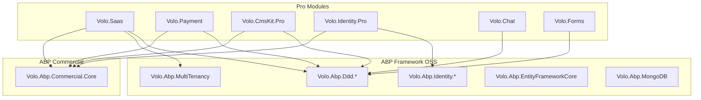

# Dependências ABP.io Pro

Este documento lista todas as dependências dos módulos ABP.io Pro.

## 📦 Dependências NuGet ABP Framework (Open Source)

Estes pacotes são do ABP Framework open source e estão disponíveis publicamente no nuget.org:

### Core

| Pacote | Versão | Descrição |
|--------|--------|-----------|
| `Volo.Abp.Ddd.Domain` | 9.0.4 | DDD Domain layer abstractions |
| `Volo.Abp.Ddd.Application.Contracts` | 9.0.4 | Application layer contracts |
| `Volo.Abp.Ddd.Application` | 9.0.4 | Application layer base |
| `Volo.Abp.AutoMapper` | 9.0.4 | AutoMapper integration |
| `Volo.Abp.Data` | 9.0.4 | Data access abstractions |
| `Volo.Abp.Caching` | 9.0.4 | Caching abstractions |
| `Volo.Abp.Validation` | 9.0.4 | Validation |
| `Volo.Abp.Localization` | 9.0.4 | Localization |

### Multi-Tenancy

| Pacote | Versão | Descrição |
|--------|--------|-----------|
| `Volo.Abp.MultiTenancy` | 9.0.4 | Multi-tenancy core |
| `Volo.Abp.TenantManagement.Domain` | 9.0.4 | Tenant management domain |

### Identity

| Pacote | Versão | Descrição |
|--------|--------|-----------|
| `Volo.Abp.Identity.Domain` | 9.0.4 | Identity domain |
| `Volo.Abp.PermissionManagement.Domain` | 9.0.4 | Permission management |
| `Volo.Abp.Users.Domain` | 9.0.4 | User abstractions |

### Infrastructure

| Pacote | Versão | Descrição |
|--------|--------|-----------|
| `Volo.Abp.EntityFrameworkCore` | 9.0.4 | EF Core integration |
| `Volo.Abp.MongoDB` | 9.0.4 | MongoDB integration |
| `Volo.Abp.AspNetCore.Mvc` | 9.0.4 | ASP.NET Core MVC |
| `Volo.Abp.AspNetCore.Mvc.UI` | 9.0.4 | MVC UI |

### Features

| Pacote | Versão | Descrição |
|--------|--------|-----------|
| `Volo.Abp.FeatureManagement.Domain` | 9.0.4 | Feature management |
| `Volo.Abp.SettingManagement.Domain` | 9.0.4 | Setting management |
| `Volo.Abp.AuditLogging.Domain` | 9.0.4 | Audit logging |
| `Volo.Abp.BackgroundJobs` | 9.0.4 | Background jobs |

### UI

| Pacote | Versão | Descrição |
|--------|--------|-----------|
| `Volo.Abp.AspNetCore.Components` | 9.0.4 | Blazor components |
| `Volo.Abp.AspNetCore.Components.Server` | 9.0.4 | Blazor Server |
| `Volo.Abp.AspNetCore.Components.WebAssembly` | 9.0.4 | Blazor WASM |

## 📦 Dependência Comercial ABP

| Pacote | Versão | Feed | Descrição |
|--------|--------|------|-----------|
| `Volo.Abp.Commercial.Core` | 9.0.4 | ABP Commercial | Core comercial com verificação de licença |
| `Volo.Abp.Commercial.SuiteTemplates` | 9.0.4 | ABP Commercial | Templates do ABP Suite |

**Feed NuGet**: `https://nuget.abp.io/{license-key}/v3/index.json`

## 📦 Dependências CMS Kit (Base)

| Pacote | Versão | Descrição |
|--------|--------|-----------|
| `Volo.CmsKit.Domain` | 9.0.4 | CMS Kit base domain |
| `Volo.CmsKit.Application` | 9.0.4 | CMS Kit base application |

## 📦 Dependências de Terceiros

### Microsoft

| Pacote | Versão | Uso |
|--------|--------|-----|
| `Microsoft.EntityFrameworkCore` | 9.0.0 | ORM |
| `Microsoft.AspNetCore.Authentication.JwtBearer` | 9.0.0 | JWT Auth |
| `Microsoft.AspNetCore.Authentication.Google` | 9.0.0 | Google Login |
| `Microsoft.AspNetCore.Authentication.MicrosoftAccount` | 9.0.0 | Microsoft Login |
| `Microsoft.AspNetCore.Authentication.Twitter` | 9.0.0 | Twitter Login |
| `Microsoft.AspNetCore.SignalR` | 1.1.0 | Real-time comm |
| `Microsoft.AspNetCore.Components.WebAssembly` | 9.0.0 | Blazor WASM |
| `Microsoft.Maui.Controls` | 9.0.0 | MAUI |

### UI Libraries

| Pacote | Versão | Uso |
|--------|--------|-----|
| `Blazorise.Bootstrap5` | 1.6.2 | UI Components |
| `Blazorise.Charts` | 1.6.2 | Charts |
| `Blazorise.Components` | 1.6.2 | Additional components |
| `Blazorise.Icons.FontAwesome` | 1.6.2 | Icons |
| `Blazorise.Markdown` | 1.6.2 | Markdown editor |
| `Blazorise.TreeView` | 1.6.2 | Tree view |

### Payment Gateways

| Pacote | Versão | Uso |
|--------|--------|-----|
| `Stripe.net` | 46.0.0 | Stripe integration |
| `PayPalCheckoutSdk` | 1.0.4 | PayPal integration |
| `Iyzipay` | 2.1.61 | Iyzico integration |
| `LSW.AlipayEasySDK` | 2.1.5 | Alipay integration |

### Utilities

| Pacote | Versão | Uso |
|--------|--------|-----|
| `Newtonsoft.Json` | 13.0.3 | JSON |
| `AutoMapper` | (via Volo.Abp) | Object mapping |
| `HtmlAgilityPack` | 1.11.67 | HTML parsing |
| `HtmlSanitizer` | 8.1.870 | HTML sanitization |
| `Markdig` | 0.37.0 | Markdown |
| `CsvHelper` | 33.0.1 | CSV handling |
| `MiniExcel` | 1.34.2 | Excel handling |
| `Humanizer` | 2.14.1 | String manipulation |

### Database

| Pacote | Versão | Uso |
|--------|--------|-----|
| `MongoDB.Driver` | 2.29.0 | MongoDB |
| `Npgsql` | 8.0.4 | PostgreSQL |
| `MySql.Data` | 9.0.0 | MySQL |
| `Oracle.EntityFrameworkCore` | 8.23.60 | Oracle |
| `Microsoft.Data.Sqlite` | 9.0.0 | SQLite |

### Messaging & SMS

| Pacote | Versão | Uso |
|--------|--------|-----|
| `Twilio` | 7.4.0 | SMS via Twilio |

### Security

| Pacote | Versão | Uso |
|--------|--------|-----|
| `IdentityModel` | 7.0.0 | OAuth/OIDC |
| `System.IdentityModel.Tokens.Jwt` | 8.1.0 | JWT |
| `BouncyCastle.Cryptography` | 2.4.0 | Cryptography |
| `Zxcvbn-netstandard` | 1.0.2 | Password strength |
| `Owl.reCAPTCHA` | 8.0.0 | reCAPTCHA |

### Logging

| Pacote | Versão | Uso |
|--------|--------|-----|
| `Serilog.AspNetCore` | 8.0.2 | Logging |
| `Serilog.Sinks.Console` | 6.0.0 | Console sink |
| `Serilog.Sinks.File` | 6.0.0 | File sink |

### Search

| Pacote | Versão | Uso |
|--------|--------|-----|
| `NEST` | 7.17.5 | Elasticsearch |

### Code Analysis

| Pacote | Versão | Uso |
|--------|--------|-----|
| `Microsoft.CodeAnalysis` | 4.5.0 | Roslyn |
| `Microsoft.CodeAnalysis.CSharp` | 4.5.0 | C# parsing |

### Testing

| Pacote | Versão | Uso |
|--------|--------|-----|
| `xunit` | 2.9.2 | Testing framework |
| `Shouldly` | 4.2.1 | Assertions |
| `NSubstitute` | 5.1.0 | Mocking |
| `bunit` | 1.31.3 | Blazor testing |
| `Microsoft.NET.Test.Sdk` | 17.11.1 | Test SDK |
| `EphemeralMongo.Core` | 1.1.3 | MongoDB testing |

### Build Tools

| Pacote | Versão | Uso |
|--------|--------|-----|
| `Fody` | 6.8.2 | IL weaving |
| `ConfigureAwait.Fody` | 3.3.2 | ConfigureAwait |

## 🔗 Grafo de Dependências



## 📁 Arquivo de Versões Centralizadas

O repositório usa **Central Package Management** do NuGet. As versões estão definidas em:

```
Directory.Packages.props
```

Este arquivo define versões para todos os pacotes, garantindo consistência:

```xml
<Project>
  <PropertyGroup>
    <ManagePackageVersionsCentrally>true</ManagePackageVersionsCentrally>
  </PropertyGroup>
  <ItemGroup>
    <PackageVersion Include="Volo.Abp.Ddd.Domain" Version="9.0.4" />
    <!-- ... -->
  </ItemGroup>
</Project>
```

## 🔄 Como Atualizar Dependências

1. Editar `Directory.Packages.props`
2. Atualizar a versão do pacote desejado
3. Executar `dotnet restore`
4. Compilar e testar

```xml
<!-- Antes -->
<PackageVersion Include="Volo.Abp.Ddd.Domain" Version="9.0.4" />

<!-- Depois -->
<PackageVersion Include="Volo.Abp.Ddd.Domain" Version="9.1.0" />
```
