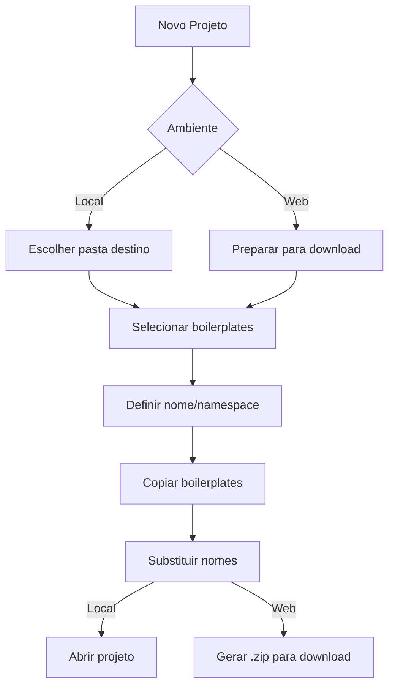
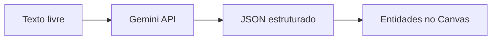

# ZenCode Generator - Product Backlog

## Visão do Produto

O ZenCode Generator é uma ferramenta visual para definir entidades e gerar código completo para projetos ABP.io, suportando múltiplos frontends (Razor, Angular, React) e gerenciamento de projetos.

---

## Épicos

### 🎯 Épico 1: Multi-Frontend Support
**Status**: 🟡 Em Progresso

| ID | Feature | Status | Descrição |
|----|---------|--------|-----------|
| MF-01 | Tipos de Frontend | ✅ Done | `FrontendTarget`, `ReactConfig`, `AngularConfig` |
| MF-02 | UI de Seleção | ✅ Done | Cards de seleção Razor/Angular/React |
| MF-03 | Templates React | ✅ Done | Page, List, Add, Edit, Delete, Form, Hook |
| MF-04 | Boilerplate React | ✅ Done | `zencode-template/abp-react/` |
| MF-05 | Templates Angular | ⬜ Todo | Module, Component, Service, Routing |
| MF-06 | Verificar Angular | ✅ Done | Template limpo confirmado |

---

### 🎯 Épico 2: Project Management
**Status**: ⬜ Planejamento

#### Objetivo
Permitir criar e gerenciar múltiplos projetos ABP diretamente no ZenCode Generator.

#### User Stories

| ID | Story | Prioridade | Complexidade |
|----|-------|------------|--------------|
| PM-01 | Como dev, quero criar um novo projeto para iniciar do zero | Alta | Média |
| PM-02 | Como dev, quero selecionar boilerplates (backend + frontends) | Alta | Média |
| PM-03 | Como dev, quero definir nome e namespace do projeto | Alta | Baixa |
| PM-04 | Como dev (local), quero que o projeto seja criado em pasta específica | Alta | Baixa |
| PM-05 | Como dev (web), quero baixar o projeto como .zip | Alta | Média |
| PM-06 | Como dev, quero abrir/importar projetos existentes | Média | Média |
| PM-07 | Como dev, quero ver lista de projetos recentes | Baixa | Baixa |

#### Arquitetura Proposta

```
/projects/                          # Pasta de projetos (local)
├── MeuProjeto1/
│   ├── backend/                    # Cópia de zencode-template
│   ├── react/                      # Cópia de zencode-template/abp-react
│   ├── angular/                    # Cópia de zencode-template/angular
│   └── zencode.json                # Metadata do projeto
└── MeuProjeto2/
    └── ...
```

#### Fluxo de Criação de Projeto



#### Componentes a Criar

| Componente | Descrição |
|------------|-----------|
| `ProjectManager.tsx` | Tela de listagem/criação de projetos |
| `NewProjectModal.tsx` | Wizard de criação de projeto |
| `ProjectCard.tsx` | Card de projeto na listagem |
| `useProjects.ts` | Hook de gerenciamento de projetos |
| `/api/projects/` | Endpoints da Bridge API |

---

### 🎯 Épico 3: AI Integration (Entity Import)
**Status**: ✅ Concluído

#### Objetivo
Permitir importar entidades e relacionamentos a partir de texto livre (output de conversas com LLMs como ChatGPT) usando Google Gemini para parsing e estruturação.

#### User Flow



**Exemplo de input:**
```
Preciso de um sistema de clínica médica com:
- Médicos (nome, CRM, especialidades)
- Clínicas (nome, endereço, telefone)
- Serviços (nome, preço, duração)
- Agenda (data, hora, médico, paciente, serviço)
- Pacientes (nome, CPF, telefone, email)

Relacionamentos:
- Médico trabalha em várias Clínicas (N:N)
- Médico oferece vários Serviços (N:N)
- Agenda vincula Médico + Paciente + Serviço
```

**Output esperado:** Entidades e relacionamentos já posicionados no canvas!

#### User Stories

| ID | Story | Prioridade | Complexidade |
|----|-------|------------|--------------|
| AI-01 | ✅ Como dev, quero colar texto descritivo e gerar entidades | Alta | Alta |
| AI-02 | ✅ Como dev, quero revisar entidades geradas antes de aplicar | Alta | Média |
| AI-03 | ✅ Como dev, quero que campos tenham tipos inferidos (string, int, etc) | Alta | Média |
| AI-04 | ⬜ Como dev, quero que relacionamentos sejam detectados automaticamente | Alta | Alta |
| AI-05 | ✅ Como dev, quero configurar minha API key do Gemini | Alta | Baixa |
| AI-06 | ⬜ Como dev, quero usar prompts customizados para melhorar resultados | Baixa | Média |

#### Arquitetura

```
zencode-generator/
├── src/
│   ├── lib/
│   │   ├── gemini/
│   │   │   ├── client.ts         # Gemini API client
│   │   │   ├── prompts.ts        # System prompts para parsing
│   │   │   └── types.ts          # Tipos de resposta
│   │   └── ai-import/
│   │       ├── parser.ts         # Converte JSON → EntityData[]
│   │       └── validator.ts      # Valida estrutura
│   └── components/
│       ├── ImportFromAIModal.tsx # Modal de importação
│       └── AIPreviewPanel.tsx    # Preview antes de aplicar
```

#### Configuração

```typescript
// .env.local ou settings
GEMINI_API_KEY=your-api-key

// Ou via UI (armazenado em localStorage)
interface AISettings {
  apiKey: string;
  model: 'gemini-2.0-flash' | 'gemini-1.5-pro';
  temperature: number;
}
```

#### Prompt Engineering

```typescript
const SYSTEM_PROMPT = `
Você é um assistente especializado em modelagem de dados para ABP Framework.
Dado um texto descritivo, extraia:

1. Entidades com campos (nome, tipo, validações)
2. Relacionamentos (1:N, N:N)
3. Enums quando aplicável

Responda APENAS em JSON válido no formato:
{
  "entities": [...],
  "relationships": [...],
  "enums": [...]
}
`;
```

#### Componentes a Criar

| Componente | Descrição |
|------------|-----------|
| `ImportFromAIModal.tsx` | Modal com textarea para colar texto |
| `AIPreviewPanel.tsx` | Preview das entidades detectadas |
| `AISettingsModal.tsx` | Configuração da API key |
| `GeminiClient.ts` | Cliente para Gemini API |
| `EntityParser.ts` | Parser de JSON para EntityData |

---

### 🎯 Épico 4: Code Injection Improvements
**Status**: ⬜ Backlog

| ID | Feature | Descrição |
|----|---------|-----------|
| CI-01 | Menu injection inteligente | Detectar posição correta no menu |
| CI-02 | DbContext injection | Adicionar entity configurations |
| CI-03 | Rollback support | Desfazer injeções |
| CI-04 | Diff preview | Mostrar alterações antes de aplicar |

---

### 🎯 Épico 5: Entity Designer Improvements
**Status**: ⬜ Backlog

| ID | Feature | Descrição |
|----|---------|-----------|
| ED-01 | Import from database | Ler schema existente |
| ED-02 | Import from C# | Parsear classes existentes |
| ED-03 | Validation preview | Ver validações em tempo real |
| ED-04 | Relationship wizard | Assistente para criar relações |

---

## Priorização (MoSCoW)

### Must Have (MVP)
- ✅ Multi-frontend selection
- ✅ React templates
- ⬜ AI Entity Import (texto → entidades)
- ⬜ Project creation workflow
- ⬜ ZIP download (web mode)

### Should Have
- ⬜ Angular templates
- ⬜ Project listing
- ⬜ Recent projects
- ⬜ AI relationship detection

### Could Have
- ⬜ Import from database
- ⬜ Rollback support
- ⬜ Diff preview

### Won't Have (this version)
- ❌ Real-time collaboration
- ❌ Cloud storage
- ❌ Version control integration

---

## Definição de Pronto (DoD)

- [ ] Código implementado e funcionando
- [ ] Testes básicos passando
- [ ] Documentação atualizada
- [ ] Screenshot/demo se aplicável

---

## Roadmap

```
Q1 2026
├── Jan: Multi-Frontend (React) ✅
├── Jan: AI Entity Import 🚀
├── Fev: Project Management
└── Mar: Angular Templates

Q2 2026
├── Abr: Code Injection v2
├── Mai: Import features
└── Jun: Polish & Documentation
```

---

*Última atualização: 2026-01-07*
